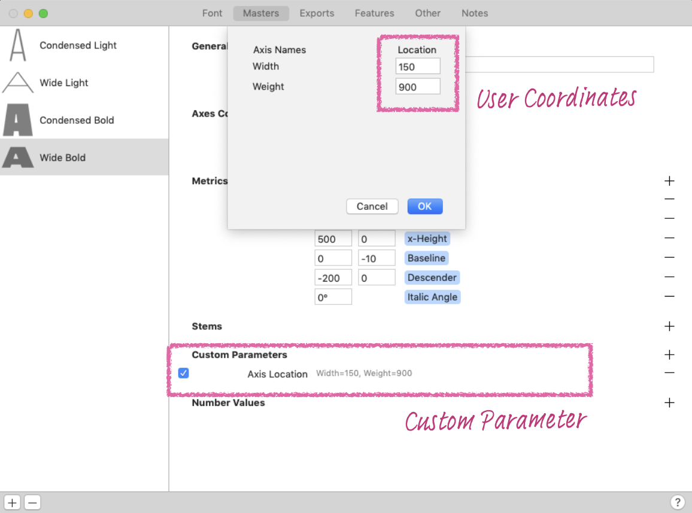
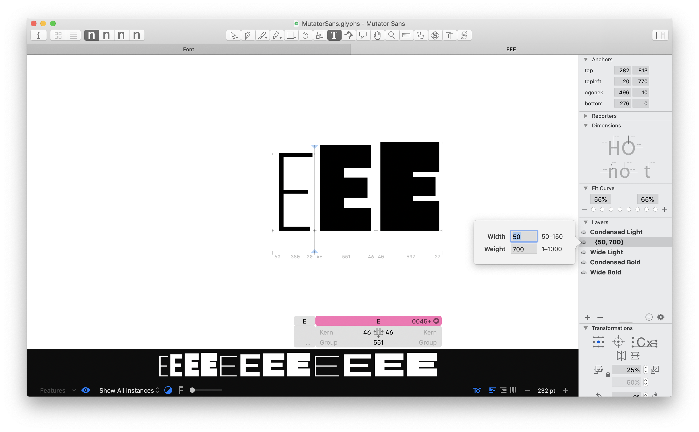
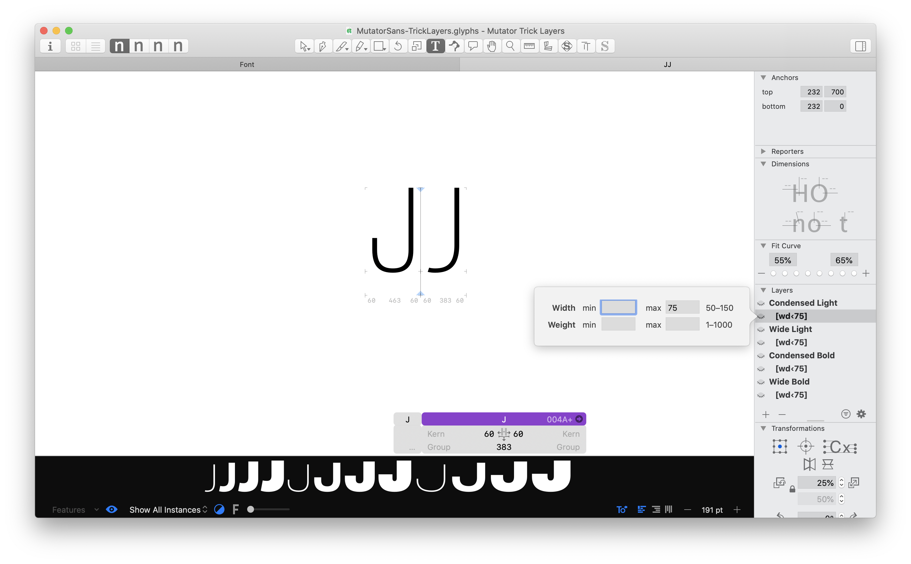

# Variable Salon Demos

These examples supplement [Guido Ferreyra](https://tipografia.com.ar)’s talk on Variable Fonts for [Type Network](http://typenetwork.com) on 2022-03-03.

They use [Mutator Sans](https://github.com/LettError/mutatorSans) by [Erik van Blokland](http://letterror.com).

[Salon video recording](https://vimeo.com/685613051)


## Mutator UFO

This example uses UFO and designspace, and is designed to be exported using [fontmake](https://github.com/googlefonts/fontmake).

To do a simple build, follow these steps in Terminal:

1. Change your working directory to the folder containing the designspace

```
$ cd /path/to/MutatorUFO
```

2. Run fontmake to generate the variable font. `-f` flattens components to a single level.

```
$ fontmake -o variable -m MutatorSans.designspace -f
```

To build static fonts for the instances, it’s a similar command, adding `-i` to build instances:

```
$ fontmake -o variable -m MutatorSans.designspace -f -i
```

A more complex build can be done with the shell script `buildMutatorSans.sh`. It builds both static and variable font files, and gives an example of postprocessing done with [gftools](http://github.com/googlefonts/gftools).

```
$ bash buildMutatorSans.sh
```

## Mutator Glyphs

This example uses [Glyphs 3](http://glyphsapp.com). They can be exported using `File > Export` in Glyphs.

It is also possible to export Glyphs files with fontmake using `-g`, but not all features may apply.

```
$ fontmake -o variable -g MutatorSans.glyphs -f -i
```

## AVAR / Axis Mapping

This technique allows you to map internal coordinates to external coordinates. This means you can use 0-1000 or stem weights or whatever your preferred values are inside the font, and still offer users axis locations that are more in-line with their expectations or the spec.

This is also an easy way to “warp” axes like `opsz` so that the rate of interpolation varies is not linear. (Not that this is different than [HOI](http://underware.nl/case-studies/hoi/) which is more advanced).

### UFO

In a designspace, these can be added `<map>` tags to an `<axis>`. Note that this involves changing a self-closing `<axis .../>` tag to an open/close pair `<axis>...</axis>`. 

```
    <axis tag="wght" name="Weight" minimum="100" maximum="900" default="100">
      <map input="100" output="1"/>
      <map input="400" output="440"/>
      <map input="700" output="760"/>
      <map input="900" output="1000"/>
    </axis>
```

### Glyphs

In a Glyphs file, you can set the `Axis Location` custom parameter for “Masters” and “Exports” to set the external user coordinates. [More info](https://glyphsapp.com/learn/creating-a-variable-font#g-axis-mappings).



Glyphs also offers a font-level `Axis Mappings` custom parameter, but as of this writing this does not appear to be fully functional in exported variable fonts.


## Intermediate layers / Supports

In instances where only a few glyphs need retouching, it doesn’t make sense to add a whole new “Source” or “Master”. Instead you can add an Intermediate Layer or Support to add additional control to an interpolation.

### UFO

Not shown in this demo yet, but possible with [Skateboard “supports”](https://superpolator.com/skateboard.html).

### Glyphs

In the Glyphs examples, the horizontals of `B`, `E`, `F`, and `G` have intermediate layers (aka brace layers). [More info.](https://glyphsapp.com/learn/additional-masters-for-individual-glyphs-the-brace-trick)




## Feature variations / Alternate layers

Feature variations allow glyphs to swap to an alternate at certain points in the designspace. They typically use the OpenType features `rvrn` or `rlig` in the final font, but can be expressed differently in the source files.

In these examples, `I` and `J` are substituted with alternate glyphs which are narrower.

### UFO

For UFOs, this be done using in a designspace using [rules](https://fonttools.readthedocs.io/en/latest/designspaceLib/readme.html#rules-element)

```
<rules>
    <rule name="narrow_letters">
      <conditionset>
        <condition name="Width" minimum="50" maximum="75"/>
        <condition name="Weight" minimum="1" maximum="900"/>
      </conditionset>
      <sub name="I" with="I.narrow"/>
      <sub name="J" with="J.narrow"/>
    </rule>
</rules>
```

### Glyphs

In Glyphs 3, this can be accomplished in one of two ways:

#### “Alternate Layer” (aka bracket layer)

In `MutatorSans-TrickLayers.glyphs`, you can see these layers for `I`, `J`, and `S`. Double click on the layer to change the location of the swap; right click on layer to change layer type.



#### Feature condition

In `MutatorSans.glyphs`, the alternates are stored as separate glyphs (`I.narrow`, `J.narrow` `S.closed`). In the OpenType features, the `rvrn` or `rlig` OpenType feature is added with conditions.

```
#ifdef VARIABLE
condition 50 < wdth < 75;
sub I by I.narrow;
sub J by J.narrow;
#endif
```

As of this writing, this is a Glyphs 3-specific technique and it only works when exporting directly from Glyphs (not through fontmake).


[More info on these approaches.](https://glyphsapp.com/learn/switching-shapes)

Either approach works! DJR finds it less confusing to work with feature variations as separate glyphs, rather than as layers.


## Italic / Slant

Demo coming soon.

## STAT table
At the moment of writing this document, most font editors/building methods can not create complete/correct STAT table for some axes setups. Therefore, STAT table need to be patched after font building.

There are several methods for patching the STAT table after building but we recommend using gftools gen-stat tool since is the simplest one.

To understand better what is the STAT table and what are the expected values please read more [here](https://learn.microsoft.com/en-us/typography/opentype/spec/stat) and also you can check how the STAT table is made on other fonts to understand how it should be for your font.

### Patching a font with gftools

Pre requisites:

- The compiled font you want to patch (.ttf, .otf)
- A .yml file with the description of the font axes and axis values (Check sample-stat.yml)
- Python 3 installed

To patch the fonts open your terminal and follow these steps:

- Install gftools (only the first time):<br>`pip install gftools`
- Patch the STAT table with:<br>
`gftools gen-stat path/to/the/font --src path/to/the/yml`